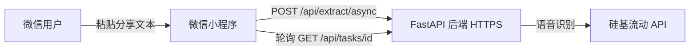

# 微信小程序发布指南

本文档说明如何将「抖音视频文案提取」发布为微信小程序。

## 架构说明



小程序通过**异步任务 API** 调用后端，避免微信 `wx.request` 60 秒超时限制。

## 第一步：注册小程序

1. 访问 [微信公众平台](https://mp.weixin.qq.com/)
2. 注册「小程序」账号（个人或企业均可）
3. 在 **开发 → 开发管理 → 开发设置** 中获取 **AppID**

## 第二步：部署后端到 HTTPS

微信小程序要求所有网络请求必须使用 **HTTPS** 且域名已备案（国内服务器）。

建议使用 Nginx 反向代理并配置 SSL 证书。完整腾讯云部署与实操记录见 [tencent-cloud-deploy.md](./tencent-cloud-deploy.md)。

### 部署要求

- 公网 HTTPS 域名，例如 `https://api.example.com`
- 服务器安装 Python 3.11+、ffmpeg
- 配置 `SILICONFLOW_API_KEY` 环境变量

### 启动示例

```bash
cd backend
source .venv/bin/activate
pip install -r requirements.txt
uvicorn app.main:app --host 0.0.0.0 --port 8000
```

建议使用 Nginx 反向代理并配置 SSL 证书。

## 第三步：配置小程序合法域名

1. 登录 [微信公众平台](https://mp.weixin.qq.com/)
2. 进入 **开发 → 开发管理 → 开发设置 → 服务器域名**
3. 在 **request 合法域名** 中添加你的后端域名，例如：
   - `https://api.example.com`

> 注意：不要带路径，不要带端口号（HTTPS 默认 443）。

## 第四步：配置项目

### 1. 填写 AppID

编辑 [`project.private.config.json`](../project.private.config.json)：

```json
{
  "appid": "wx你的AppID"
}
```

或在微信开发者工具中：**详情 → 基本信息 → AppID** 填入。

### 2. 配置 API 地址

编辑 [`miniprogram/utils/config.js`](../miniprogram/utils/config.js)：

```javascript
const API_BASE_URL = 'https://api.example.com'
```

## 第五步：本地调试

1. 下载并安装 [微信开发者工具](https://developers.weixin.qq.com/miniprogram/dev/devtools/download.html)
2. 选择「导入项目」，目录选择本项目根目录（含 `project.config.json`）
3. 开发阶段可在 **详情 → 本地设置** 中勾选：
   - **不校验合法域名、web-view（业务域名）、TLS 版本以及 HTTPS 证书**
4. 确保本地后端已启动：`uvicorn app.main:app --port 8000`
5. 点击「编译」预览

## 第六步：真机预览与上传

1. 点击工具栏 **预览**，扫码在手机上测试
2. 测试通过后点击 **上传**，填写版本号与备注
3. 登录微信公众平台 → **管理 → 版本管理 → 开发版本**
4. 提交审核，填写类目与功能说明

### 审核建议

- **服务类目**：工具 → 信息查询，或根据实际选择最接近类目
- **功能说明**：提供抖音分享链接，自动提取视频中语音并转为文字
- **测试账号/说明**：提供可正常解析的抖音分享链接样例

## API 接口（小程序专用）

### 创建异步任务

```http
POST /api/extract/async
Content-Type: application/json

{"share_text": "https://v.douyin.com/xxx/ ..."}
```

响应：

```json
{"task_id": "abc123..."}
```

### 查询任务状态

```http
GET /api/tasks/{task_id}
```

响应：

```json
{
  "task_id": "abc123",
  "status": "processing",
  "result": null,
  "error": null
}
```

`status` 取值：`pending` | `processing` | `done` | `failed`

完成时 `result` 包含：

```json
{
  "video_id": "...",
  "title": "...",
  "transcript": "...",
  "duration_seconds": 269.8
}
```

## 常见问题

### 1. 请求失败 / 不在合法域名列表

- 确认已在小程序后台配置 request 合法域名
- 开发阶段可临时关闭域名校验

### 2. 处理超时

- 默认最长轮询约 6 分钟（180 次 × 2 秒）
- 可在 `miniprogram/utils/config.js` 调整 `MAX_POLL_ATTEMPTS`

### 3. 抖音链接在小程序内无法直接打开

- 本应用只需用户**粘贴分享文本**，无需在小程序内打开抖音
- 用户从抖音 App 复制分享文本后，回到小程序粘贴即可

## 项目结构

```
violet/
├── miniprogram/           # 微信小程序源码
│   ├── pages/index/       # 首页
│   └── utils/             # API 与配置
├── project.config.json    # 微信开发者工具项目配置
└── docs/miniprogram-deploy.md
```
