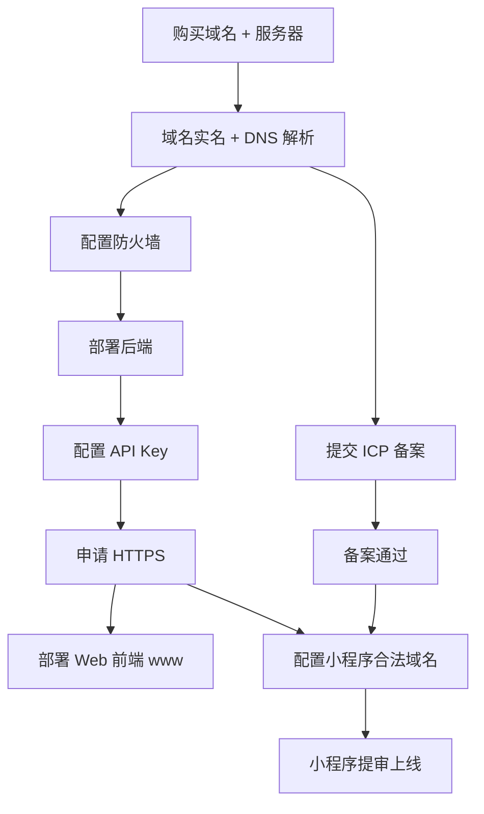
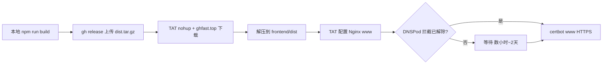

# 腾讯云上线部署指南

本文档记录将「抖音视频文案提取」项目部署到腾讯云（域名 + 轻量服务器 + 备案 + 小程序）的完整流程。以本项目实际配置为例：

| 资源 | 示例值 |
|------|--------|
| 主域名 | `violet37.cn` |
| API 子域名 | `api.violet37.cn` |
| Web 子域名 | `www.violet37.cn` |
| 服务器 | 腾讯云轻量 4核4G3M，上海，Ubuntu 22.04 |
| 公网 IP | `110.42.220.210`（以控制台为准） |
| 代码目录 | `/opt/violet` |

小程序发布细节另见 [miniprogram-deploy.md](./miniprogram-deploy.md)。

---

## 整体流程



**可并行：** 备案审核（7–20 天）期间，可先完成服务器部署，并用开发者工具「不校验合法域名」调试。

---

## 阶段 0：购买资源

### 域名

1. 打开 [域名注册](https://buy.cloud.tencent.com/domain)
2. 注册 `violet37.cn`（`.cn` 需实名，首年约 33 元）
3. 建议勾选：**自动续费**、**禁止转移锁**
4. **不要**勾选「禁止更新锁」（后续还要改 DNS）

### 轻量服务器

1. 打开 [轻量云专场特惠](https://cloud.tencent.com/act/pro/lhsale)
2. 推荐：**4核4G3M，99 元/年**（新用户）
3. 配置选择：

| 选项 | 推荐值 |
|------|--------|
| 应用创建方式 | **基于操作系统镜像** |
| 镜像 | **Ubuntu 22.04 LTS** |
| 地域 | **上海**（或离用户近的地域） |
| 时长 | **1 年**（备案要求 ≥3 个月） |

---

## 阶段 1：域名配置

### 1.1 域名实名（.cn 必做）

1. [域名控制台](https://console.cloud.tencent.com/domain/all-domain/all) → 找到 `violet37.cn`
2. 完成实名认证（通常几小时到 1 天）
3. 新注 `.cn` 域名会经历 **CNNIC 命名审核**（1–2 天），审核通过前可能显示「域名命名审核中」

### 1.2 添加 DNS 解析

1. 域名列表 → 点击 **解析**，或进入 [DNSPod 解析](https://console.cloud.tencent.com/cns)
2. 选择 `violet37.cn` → **添加记录**

| 主机记录 | 记录类型 | 记录值 | TTL |
|---------|---------|--------|-----|
| `api` | A | 轻量服务器公网 IP | 600（默认） |
| `www` | A | 轻量服务器公网 IP | 600（默认） |

生效后：

- `api.violet37.cn` → 后端 API
- `www.violet37.cn` → Web 前端站点

> **子域名说明：** 购买 `violet37.cn` 后，可在 DNS 里免费添加 `api`、`www` 等前缀，**无需再买一个域名**。`api.violet37.cn` 仍是 `violet37.cn` 的一部分；备案主域名填 `violet37.cn`，子域名一并纳入备案。

验证：

```bash
dig +short api.violet37.cn
dig +short www.violet37.cn
# 均应返回服务器 IP
```

**实操提示：** DNSPod 添加记录时，「记录值」须填服务器 IP。若网页表单提交报「内容不能为空」，可改用浏览器直接填写 `input[name="Value"]` 后再点确认。

---

## 阶段 2：服务器防火墙

1. [轻量服务器控制台](https://console.cloud.tencent.com/lighthouse/instance) → 点击实例 → **防火墙** 标签
2. 确认以下入站规则（没有则 **添加规则**）：

| 应用类型 | 协议 | 端口 | 策略 |
|---------|------|------|------|
| Linux 登录 | TCP | 22 | 允许 |
| HTTP | TCP | 80 | 允许 |
| HTTPS | TCP | 443 | 允许 |

> 轻量防火墙只控制入站；出站默认放行（25 端口除外）。

---

## 阶段 3：部署后端

有三种方式，任选其一。

### 方式 A：一键脚本（SSH / OrcaTerm）

登录服务器后执行：

```bash
curl -fsSL https://raw.githubusercontent.com/Violit-Evergarden/violet/main/scripts/deploy-server.sh | bash
```

或克隆仓库后：

```bash
bash scripts/deploy-server.sh
```

脚本会安装依赖、拉代码、配置 systemd + Nginx。首次运行若 `.env` 未配置，会提示填入 API Key 后重跑。

### 方式 B：控制台「执行命令」（免 SSH）

适合无法 SSH 登录、但已安装自动化助手（TAT）的实例。

1. 实例详情 → **执行命令** → **执行命令**
2. 超时建议设为 **600 秒**

**命令 1：安装依赖 + 拉代码**

```bash
export DEBIAN_FRONTEND=noninteractive
apt-get update -qq
apt-get install -y -qq python3 python3-pip python3-venv ffmpeg nginx git
mkdir -p /opt && cd /opt
git clone https://github.com/Violit-Evergarden/violet.git 2>/dev/null || (cd violet && git pull)
cd /opt/violet/backend
python3 -m venv .venv
.venv/bin/pip install -q -r requirements.txt
cp -n .env.example .env
echo done
```

**命令 2：systemd + Nginx**

```bash
cat > /etc/systemd/system/violet.service << 'EOF'
[Unit]
Description=Violet FastAPI
After=network.target
[Service]
User=root
WorkingDirectory=/opt/violet/backend
EnvironmentFile=/opt/violet/backend/.env
Environment=PATH=/opt/violet/backend/.venv/bin:/usr/local/sbin:/usr/local/bin:/usr/sbin:/usr/bin:/sbin:/bin
ExecStart=/opt/violet/backend/.venv/bin/uvicorn app.main:app --host 127.0.0.1 --port 8000
Restart=always
RestartSec=5
[Install]
WantedBy=multi-user.target
EOF
systemctl daemon-reload && systemctl enable violet && systemctl restart violet

cat > /etc/nginx/sites-available/violet-api << 'EOF'
server {
    listen 80;
    server_name api.violet37.cn;
    location / {
        proxy_pass http://127.0.0.1:8000;
        proxy_set_header Host $host;
        proxy_set_header X-Real-IP $remote_addr;
        proxy_set_header X-Forwarded-For $proxy_add_x_forwarded_for;
        proxy_set_header X-Forwarded-Proto $scheme;
        proxy_read_timeout 300s;
    }
}
EOF
ln -sf /etc/nginx/sites-available/violet-api /etc/nginx/sites-enabled/
rm -f /etc/nginx/sites-enabled/default
nginx -t && systemctl reload nginx
curl -sf http://127.0.0.1:8000/api/health; echo
```

> **重要：** systemd 的 `Environment=PATH` 必须包含 `/usr/bin`，否则 `ffmpeg` / `ffprobe` 检测会失败（健康检查显示 `ffmpeg_available: false`）。

### 方式 C：手动逐步（SSH）

```bash
# 1. 依赖
sudo apt update && sudo apt install -y python3 python3-venv ffmpeg nginx git

# 2. 代码
sudo git clone https://github.com/Violit-Evergarden/violet.git /opt/violet
cd /opt/violet/backend
python3 -m venv .venv && source .venv/bin/activate
pip install -r requirements.txt
cp .env.example .env   # 编辑填入 SILICONFLOW_API_KEY

# 3. 启动（临时验证）
uvicorn app.main:app --host 127.0.0.1 --port 8000
```

长期运行请使用方式 A/B 中的 systemd 配置。

---

## 阶段 4：配置 API Key

密钥与本地 `backend/.env` 中相同，写入服务器 `/opt/violet/backend/.env` 后重启服务。

### 方式 A：SSH / OrcaTerm 编辑

```bash
nano /opt/violet/backend/.env
```

内容示例：

```env
SILICONFLOW_API_KEY=sk-你的真实密钥
TEMP_DIR=/tmp/violet
```

保存后：

```bash
chmod 600 /opt/violet/backend/.env
systemctl restart violet
```

### 方式 B：控制台「执行命令」（免 SSH）

实例详情 → **执行命令**，超时 **60 秒**，一次性写入并重启：

```bash
cat > /opt/violet/backend/.env << 'EOF'
SILICONFLOW_API_KEY=sk-你的真实密钥
TEMP_DIR=/tmp/violet
EOF
chmod 600 /opt/violet/backend/.env
systemctl restart violet
sleep 2
curl -sf http://127.0.0.1:8000/api/health; echo
```

也可在控制台 **文件管理** 中直接编辑 `.env`。

### 验证

```bash
curl http://api.violet37.cn/api/health
```

期望返回：

```json
{"status":"ok","ffmpeg_available":true,"api_key_configured":true}
```

| 字段 | 含义 |
|------|------|
| `status: degraded` | ffmpeg 或 API Key 仍有问题 |
| `ffmpeg_available: false` | 见下文 PATH 修复 |
| `api_key_configured: false` | `.env` 仍是 `sk-xxx` 或未重启 |

---

## 阶段 5：HTTPS 证书

DNS 生效后即可申请 Let's Encrypt 免费证书（**不依赖 ICP 备案**）。

### 申请证书

SSH 或「执行命令」（超时建议 **180 秒**）：

```bash
export DEBIAN_FRONTEND=noninteractive
apt-get install -y -qq certbot python3-certbot-nginx
certbot --nginx -d api.violet37.cn --non-interactive --agree-tos \
  -m 2232102177@qq.com --redirect
curl -sf https://api.violet37.cn/api/health; echo
```

`--redirect` 会将 HTTP 自动跳转 HTTPS。

### 修改 Certbot 通知邮箱

证书续期提醒会发到该邮箱：

```bash
certbot update_account --email 2232102177@qq.com --non-interactive --agree-tos
```

成功时输出：`Your e-mail address was updated to ...`

### 验证

```bash
curl https://api.violet37.cn/api/health
```

证书自动续期由 certbot 定时任务处理，可用 `certbot renew --dry-run` 测试。

---

## 阶段 5.5：部署 Web 前端（www 子域名）

Web 前端（React + Vite）部署到 `www.violet37.cn`，与 API 子域名分离：

| 子域名 | 用途 | Nginx 行为 |
|--------|------|------------|
| `api.violet37.cn` | 后端 API / 小程序 | 反代 → `127.0.0.1:8000` |
| `www.violet37.cn` | 浏览器访问的网站 | 静态文件 + `/api/` 反代 |

前端代码使用相对路径 `/api/...`，因此 **无需改代码**；Nginx 在同域下把 API 请求转发到后端即可。

### 前置条件

1. [阶段 1.2](#12-添加-dns-解析) 已添加 `www` 的 A 记录指向服务器 IP
2. 后端已部署且健康检查通过（[阶段 3–4](#阶段-3部署后端)）

验证 DNS：

```bash
dig +short www.violet37.cn
# 应返回 110.42.220.210
```

### 方式 A：一键脚本（SSH / OrcaTerm）

后端已部署的情况下，只需运行前端脚本：

```bash
cd /opt/violet
git pull
bash scripts/deploy-frontend.sh
```

全新部署时，`deploy-server.sh` 会在 API 部署完成后自动调用该脚本。

### 方式 B：控制台「执行命令」（免 SSH）

> **TAT 限制：** 轻量「执行命令」实际超时上限为 **60 秒**（界面填 600 也可能仍 60 秒超时）。`npm install` / `npm ci` 通常超过 60 秒，**不要**在一条 TAT 命令里装 Node + 构建 + Nginx + Certbot。推荐：
> 1. **OrcaTerm**（实例页 → **登录**）SSH 交互执行 `bash scripts/deploy-frontend.sh`
> 2. 或 TAT 分步：后台 `nohup npm install` → 轮询 → 再 Nginx/Certbot

超时建议：安装 Node **60s**（仅 apt）；构建请用 OrcaTerm。

**OrcaTerm 推荐命令（无超时限制）：**

```bash
cd /opt/violet && git pull
bash scripts/deploy-frontend.sh
```

**TAT 分步示例（仅 Nginx + HTTPS，需 `frontend/dist` 已存在）：**

```bash
cat > /etc/nginx/sites-available/violet-web << 'EOF'
server {
    listen 80;
    server_name www.violet37.cn;
    root /opt/violet/frontend/dist;
    index index.html;
    location /api/ {
        proxy_pass http://127.0.0.1:8000;
        proxy_set_header Host $host;
        proxy_set_header X-Real-IP $remote_addr;
        proxy_set_header X-Forwarded-For $proxy_add_x_forwarded_for;
        proxy_set_header X-Forwarded-Proto $scheme;
        proxy_read_timeout 300s;
    }
    location / {
        try_files $uri $uri/ /index.html;
    }
}
EOF
ln -sf /etc/nginx/sites-available/violet-web /etc/nginx/sites-enabled/
nginx -t && systemctl reload nginx
certbot --nginx -d www.violet37.cn --non-interactive --agree-tos \
  -m 2232102177@qq.com --redirect
curl -sf https://www.violet37.cn/api/health; echo
```

**TAT 一键命令（仅当 OrcaTerm 不可用时，易超时，不推荐）：**

```bash
export DEBIAN_FRONTEND=noninteractive
APP_DIR=/opt/violet
WEB_DOMAIN=www.violet37.cn

if ! command -v node >/dev/null 2>&1 || [ "$(node -p 'process.versions.node.split(".")[0]')" -lt 18 ]; then
  apt-get update -qq
  apt-get install -y -qq ca-certificates curl gnupg
  curl -fsSL https://deb.nodesource.com/setup_20.x | bash -
  apt-get install -y -qq nodejs
fi

cd "$APP_DIR" && git pull
cd frontend && npm ci --no-audit --no-fund && npm run build

cat > /etc/nginx/sites-available/violet-web << EOF
server {
    listen 80;
    server_name $WEB_DOMAIN;
    root $APP_DIR/frontend/dist;
    index index.html;
    location /api/ {
        proxy_pass http://127.0.0.1:8000;
        proxy_set_header Host \$host;
        proxy_set_header X-Real-IP \$remote_addr;
        proxy_set_header X-Forwarded-For \$proxy_add_x_forwarded_for;
        proxy_set_header X-Forwarded-Proto \$scheme;
        proxy_read_timeout 300s;
    }
    location / {
        try_files \$uri \$uri/ /index.html;
    }
}
EOF

ln -sf /etc/nginx/sites-available/violet-web /etc/nginx/sites-enabled/
nginx -t && systemctl reload nginx

apt-get install -y -qq certbot python3-certbot-nginx
certbot --nginx -d "$WEB_DOMAIN" --non-interactive --agree-tos \
  -m 2232102177@qq.com --redirect
curl -sf "https://$WEB_DOMAIN/api/health"; echo
```

### 方式 C：本地构建 + 上传 dist（服务器 npm 失败时推荐）

当 TAT 超时、OrcaTerm `npm ci` 卡住、或服务器访问 GitHub 极慢时，**在本地 Mac 构建**，再把 `dist` 传到服务器。这是 2026-06-20 实际上线 www 时验证成功的路径。

**步骤 1：本地构建**

```bash
cd frontend
npm ci && npm run build
tar czf /tmp/frontend-dist.tar.gz -C dist .
ls -la /tmp/frontend-dist.tar.gz   # 约 70KB
```

**步骤 2：上传到 GitHub Release（临时）**

```bash
gh release create deploy-www-$(date +%s) /tmp/frontend-dist.tar.gz \
  --repo Violit-Evergarden/violet \
  --title "temp frontend dist" --notes "临时构建产物，部署后可删"
```

记下 Release tag，例如 `deploy-www-temp-1781946192`。

**步骤 3：TAT 后台下载并解压**

> 服务器直连 GitHub / `mirror.ghproxy.com` 易 60s 超时；**ghfast.top 镜像** 在本项目中验证可用。

```bash
nohup bash -c '
  URL="https://ghfast.top/https://github.com/Violit-Evergarden/violet/releases/download/你的TAG/frontend-dist.tar.gz"
  curl -fsSL "$URL" -o /tmp/frontend-dist.tar.gz
  mkdir -p /opt/violet/frontend/dist
  tar xzf /tmp/frontend-dist.tar.gz -C /opt/violet/frontend/dist
  touch /tmp/dist-downloaded
  ls -la /opt/violet/frontend/dist
' > /tmp/dist-download.log 2>&1 &
echo "后台下载已启动，稍后 TAT 检查: cat /tmp/dist-download.log; ls /tmp/dist-downloaded"
```

**步骤 4：Nginx + HTTPS**

dist 就绪后，执行 [方式 B 的 TAT 分步 Nginx 命令](#方式-b控制台执行命令免-ssh)，或 OrcaTerm 运行 `bash scripts/deploy-frontend.sh`（会跳过 npm 构建若 dist 已存在——脚本仍会跑 npm，建议只执行 Nginx + certbot 部分）。

**步骤 5：清理**

确认站点正常后，删除临时 Release：`gh release delete 你的TAG --repo Violit-Evergarden/violet --yes`

### 验证

**服务器本地（不受 DNSPod 备案拦截影响）：**

```bash
curl -H "Host: www.violet37.cn" http://127.0.0.1/ | head -3
curl -sS http://127.0.0.1:8000/api/health
curl -sf -k https://127.0.0.1/api/health -H "Host: www.violet37.cn"
```

**公网（备案通过后）：**

```bash
curl -L -I http://www.violet37.cn          # 不应再 302 到 webblock.html
curl https://www.violet37.cn/api/health
curl https://api.violet37.cn/api/health
```

浏览器打开 **https://www.violet37.cn**，粘贴抖音分享链接测试提取文案。

### 仅更新前端（不改后端）

```bash
cd /opt/violet && git pull
cd frontend && npm ci && npm run build
# Nginx 已配置则无需 reload
```

---

## 阶段 6：ICP 备案

微信小程序 **正式环境** 要求域名已完成 ICP 备案。

### 6.1 入口

1. [备案控制台](https://console.cloud.tencent.com/beian)
2. 首次使用需 **同意 ICP 备案服务授权**
3. 点击 **新增备案**

### 6.2 验证备案类型（第一步）

| 字段 | 填写说明 |
|------|---------|
| 信息填写方式 | 勾选 **复用腾讯云账号信息填写** |
| 备案区域 | 选证件所在省/市（身份证 420 开头 → **湖北省 → 宜昌市**） |
| 主办单位性质 | **个人** |
| 证件类型 | **居民身份证** |
| 上传证件 | **拍照上传** 身份证正反面（须本人操作） |
| 应用服务类型 | **网站/域名** |
| 域名 | `violet37.cn`（主域名，不是 `api.` 前缀） |
| 云资源 | **轻量应用服务器** → 选择公网 IP |

> **无需线下办理：** 弹窗中的「湖北省 / 湖北省通信管理局」只表示**线上审核归属地**，不是让你去湖北现场。全程在腾讯云备案网页完成，身份证只需 **拍照上传**。

**温馨提示弹窗要点：**

- 信息提交后较难修改，提交前核对姓名、证件号
- `.cn` 域名实名完成后，与工信部系统同步可能需 **2–3 天**，可先继续填表
- 证件加水印时只能写：**仅限 ICP 备案使用**

### 6.3 网站信息（服务名称与备注）

**服务名称（网站）** 推荐（任选）：

- `紫罗兰工具`
- `视频文案提取`

避免：「抖音」等商标词、「测试站」等过虚名称。

**备注**（不少于 15 字，可直接复制）：

```
本网站为个人开发的在线工具服务，用户提交视频分享链接后，系统自动提取音频并转换为文字，供个人学习笔记与内容整理使用，不涉及视频存储与传播。
```

> 微信小程序备案在 [微信公众平台](https://mp.weixin.qq.com/) 单独进行；此处备的是 **网站/域名**（`violet37.cn`），API 子域名 `api.violet37.cn` 随主域名一并覆盖。

### 6.4 后续流程

| 阶段 | 耗时 |
|------|------|
| 腾讯云初审 | 1–2 个工作日 |
| 工信部短信核验 | 收到短信后 24 小时内完成 |
| 管局审核 | 约 7–20 天 |

备案期间 API 仍可访问；小程序正式域名需等备案通过。

---

## 阶段 7：小程序配置与上线

HTTPS 可用后即可改项目配置；**正式上线**须等 ICP 备案通过并配置合法域名。

### 7.1 修改项目配置

`miniprogram/utils/config.js`（本项目已配置）：

```javascript
const API_BASE_URL = 'https://api.violet37.cn'
```

### 7.2 配置合法域名

1. [微信公众平台](https://mp.weixin.qq.com/) → **开发 → 开发管理 → 开发设置 → 服务器域名**
2. **request 合法域名** 添加：`https://api.violet37.cn`（不带路径和端口）

### 7.3 调试与发布

- **备案前调试**：开发者工具 → 详情 → 本地设置 → 勾选「不校验合法域名」
- **真机预览** → **上传** → 公众平台 **提交审核**
- 类目建议：**工具 → 效率**

详见 [miniprogram-deploy.md](./miniprogram-deploy.md)。

---

## 验证清单

| 检查项 | 命令 / 方式 | 期望结果 |
|--------|------------|---------|
| DNS 解析 | `dig +short api.violet37.cn` | 返回服务器 IP |
| DNS 解析 www | `dig +short www.violet37.cn` | 返回服务器 IP |
| HTTP 健康检查 | `curl http://api.violet37.cn/api/health` | `status: ok` |
| HTTPS API | `curl https://api.violet37.cn/api/health` | 证书有效 |
| HTTPS Web | `curl https://www.violet37.cn/api/health` | 证书有效 |
| Web 首页 | 浏览器打开 `https://www.violet37.cn` | 显示提取工具页 |
| 异步提取 | `curl -X POST https://api.violet37.cn/api/extract/async ...` | 返回 `task_id` |
| 服务状态 | `systemctl status violet` | `active (running)` |
| 备案拦截已解除 | `curl -I http://www.violet37.cn` | **无** `webblock.html` 302 |

---

## 常见问题

### 健康检查 `ffmpeg_available: false`

systemd 服务 PATH 未包含系统目录。修复：

```bash
sed -i 's|Environment=PATH=/opt/violet/backend/.venv/bin|Environment=PATH=/opt/violet/backend/.venv/bin:/usr/local/sbin:/usr/local/bin:/usr/sbin:/usr/bin:/sbin:/bin|' /etc/systemd/system/violet.service
systemctl daemon-reload && systemctl restart violet
```

### 健康检查 `api_key_configured: false`

`.env` 中仍是 `sk-xxx` 占位符，或未重启服务。编辑 `/opt/violet/backend/.env` 后 `systemctl restart violet`。

### 域名「命名审核中」

新注 `.cn` 正常状态，等待 CNNIC 审核即可，一般 1–2 天。

### 备案 vs HTTPS

- **HTTPS（Let's Encrypt）**：不依赖备案，DNS 生效即可申请
- **小程序 request 合法域名**：国内服务器 **必须备案**

### 更新代码

> 工具箱多页架构下，通常只需更新变更的部分。新增工具流程见 [adding-tools.md](./adding-tools.md)。

**后端（OrcaTerm 推荐）：**

```bash
cd /opt/violet && git pull
cd backend && .venv/bin/pip install -q -r requirements.txt
systemctl restart violet
curl -sS http://127.0.0.1:8000/api/health
```

**Web 前端（本地 build + 上传 dist，勿在服务器 npm）：**

```bash
cd frontend && npm ci && npm run build
tar czf /tmp/frontend-dist.tar.gz -C dist .
scp /tmp/frontend-dist.tar.gz root@你的服务器IP:/tmp/
# 服务器解压：
# tar xzf /tmp/frontend-dist.tar.gz -C /opt/violet/frontend/dist
```

若服务器 `npm ci` 可用，也可：

```bash
cd /opt/violet && git pull
bash scripts/deploy-frontend.sh
```

### `api.violet37.cn` 和买的 `violet37.cn` 冲突吗？

不冲突。根域名与子域名关系：

```
violet37.cn           ← 注册的主域名
├── api.violet37.cn   ← DNS 主机记录 api，给后端 API / 小程序
├── www.violet37.cn   ← DNS 主机记录 www，给 Web 前端站点
└── @ / 留空          ← 可选，直接访问根域名
```

小程序 request 合法域名填 **`https://api.violet37.cn`**；备案填 **`violet37.cn`**。

### DNSPod 表单「内容不能为空」

添加 A 记录时，记录值填 IP 后仍报错，多为前端未触发校验。可重新聚焦「记录值」输入框手动输入 IP，或用开发者工具设置 `input[name="Value"]` 后再点确认。

### 公网访问显示 DNSPod 备案拦截页（webblock.html）

**现象：** 访问 `http://www.violet37.cn` 或 `http://api.violet37.cn` 返回 302，跳转到 `https://dnspod.qcloud.com/static/webblock.html?d=...`。

**原因：** 腾讯云 DNSPod 对 **未完成 ICP 备案或未同步** 的域名在公网 HTTP 层拦截，与 Nginx 配置无关。即使直连服务器 IP 并带 `Host` 头，外网请求仍可能被拦截；**服务器本地** `curl -H "Host: www.violet37.cn" http://127.0.0.1/` 不受影响。

**处理：**

1. 确认 [备案控制台](https://console.cloud.tencent.com/beian) 状态为「已通过」
2. 备案通过后 **DNSPod 解除拦截通常需数小时至 1–2 天**，非即时生效
3. 解除后再申请 `www` 的 HTTPS（Let's Encrypt HTTP-01 验证也会被拦截页干扰）：

```bash
certbot --nginx -d www.violet37.cn --non-interactive --agree-tos \
  -m 2232102177@qq.com --redirect
```

4. 验证：`curl -I http://www.violet37.cn` 应返回 `200` 或 `301` 到 HTTPS，**不应**再出现 `webblock.html`

### Certbot 申请 www 证书失败（unauthorized / webblock）

**现象：** `Certbot failed to authenticate ... Invalid response from https://dnspod.qcloud.com/static/webblock.html`

**原因：** 备案拦截页替换了 Let's Encrypt 的 HTTP-01 验证响应。

**处理：** 等 DNSPod 拦截解除后再执行 certbot；`api.violet37.cn` 若已在拦截前签过证书则不受影响。

---

## 附录：实操记录（2026-06-20）

以下为项目首次上线时在腾讯云控制台实际完成的步骤，供对照。

### 已完成

| 步骤 | 方式 | 结果 |
|------|------|------|
| DNS `api` → A 记录 | DNSPod 控制台 | `api.violet37.cn` → `110.42.220.210` |
| 防火墙 443 | 轻量实例 → 防火墙 | 22 / 80 / 443 已放行 |
| 安装依赖 + 拉代码 | 执行命令 ×1（600s） | 命令成功 |
| systemd + Nginx | 执行命令 ×1（120s） | 命令成功 |
| 修复 ffmpeg PATH | 执行命令 ×1 | `ffmpeg_available: true` |
| 写入 API Key + 重启 | 执行命令 ×1 | `api_key_configured: true` |
| 申请 HTTPS | 执行命令 ×1（180s） | `https://api.violet37.cn` 可用 |
| Certbot 邮箱 | 执行命令 ×1 | 改为 `2232102177@qq.com` |
| 小程序 API 地址 | 改 `config.js` | `https://api.violet37.cn` |
| ICP 备案 | 备案控制台 | 已通过（2026-06-20 用户确认） |

### 2026-06-20 续：Web 前端子域名（Chrome MCP 代操作）

使用 **Chrome DevTools MCP**（`user-chrome-devtools`）在已登录腾讯云控制台中代操作，完整记录如下。

#### 最终状态（2026-06-20 17:49 复验）

| 检查项 | 方式 | 结果 |
|--------|------|------|
| DNS `www` A 记录 | DNSPod | ✅ 共 2 条（`api` + `www`） |
| `frontend/dist` | ghfast 下载 Release | ✅ 已解压至 `/opt/violet/frontend/dist` |
| Nginx `violet-web` | TAT | ✅ 已 enable + reload |
| 后端 `violet` | TAT | ✅ active |
| 本地 www 首页 | `curl -H Host www http://127.0.0.1/` | ✅ 正常 HTML |
| 本地 API 健康 | `curl 127.0.0.1:8000/api/health` | ✅ `status:ok` |
| API HTTPS 证书 | certbot | ✅ `api.violet37.cn` 有效至 2026-09-18 |
| www HTTPS 证书 | certbot | ⏳ **失败**（DNSPod 仍返回 webblock，LE 验证被拒） |
| 公网 `http://www.violet37.cn` | curl 外网 | ❌ 302 → `webblock.html`（备案拦截未解除） |
| 公网 `http://api.violet37.cn` | curl 外网 | ❌ 302 → `webblock.html` |
| 公网 `https://api.violet37.cn` | curl 外网 | ❌ connection reset（拦截层影响） |
| 直连 IP + HTTPS + Host api | curl | ✅ `{"status":"ok",...}` |

> **结论：** 服务器侧部署已完成；备案控制台虽显示通过，**DNSPod 公网拦截尚未同步解除**（常见延迟数小时～2 天）。拦截解除前无法完成 www 的 Certbot，公网域名也无法正常访问。

#### 推荐部署路径（已验证成功）



#### 分步操作记录

| 步骤 | 方式 | 结果 |
|------|------|------|
| 安装 Node.js 20 | TAT | ✅ Node 20.20.2 |
| DNS `www` A 记录 | DNSPod + 微信 MFA | ✅ 已保存 |
| TAT `nohup npm ci` | TAT 后台 | ❌ `Exit handler never called` |
| OrcaTerm `npm ci` | 交互终端 | ❌ 长时间卡住（node_modules 不增长） |
| **本地构建 + Release** | Mac `npm run build` + `gh release` | ✅ dist ~70KB |
| **ghfast 下载 dist** | TAT `nohup curl` | ✅（直连 GitHub / ghproxy 均超时） |
| Nginx www 站点 | TAT | ✅ |
| Certbot www | TAT | ❌ webblock 导致 LE unauthorized |
| 服务器状态复验 | TAT 2026-06-20 17:48 | ✅ 全部 local OK |

#### Chrome MCP 操作要点

**1. DNSPod 添加 `www` A 记录**

1. 打开 [DNSPod 记录管理](https://console.cloud.tencent.com/cns/detail/violet37.cn/records)
2. 点击 **添加记录** → 点 **www** 快捷按钮
3. 记录值用脚本填入（`fill` 可能失败）：

```javascript
// evaluate_script
const setter = Object.getOwnPropertyDescriptor(window.HTMLInputElement.prototype, 'value').set;
const val = document.querySelector('input[name="Value"]');
setter.call(val, '110.42.220.210');
val.dispatchEvent(new Event('input', { bubbles: true }));
val.dispatchEvent(new Event('change', { bubbles: true }));
```

4. 点 **确认** → **微信扫码 MFA** 后再确认
5. 验证：列表应显示 **共 2 条**（`api` + `www`）

**2. 轻量「执行命令」（TAT）**

1. [实例详情 → 执行命令](https://console.cloud.tencent.com/lighthouse/instance/detail?searchParams=rid%3D4&rid=4&id=lhins-5e0u3rze&tab=command)
2. MCP `fill_form` 填入 `textarea[autocomplete="list"]` 与超时字段
3. **超时填 600 仍可能 60 秒硬超时**；npm 构建勿用 TAT 单条命令

**3. ghfast 下载命令模板（TAT 后台）**

```bash
nohup bash -c '
  curl -fsSL "https://ghfast.top/https://github.com/Violit-Evergarden/violet/releases/download/deploy-www-temp-1781946192/frontend-dist.tar.gz" \
    -o /tmp/frontend-dist.tar.gz
  mkdir -p /opt/violet/frontend/dist
  tar xzf /tmp/frontend-dist.tar.gz -C /opt/violet/frontend/dist
  touch /tmp/dist-downloaded
' > /tmp/dist-download.log 2>&1 &
```

#### 踩坑记录

| 现象 | 原因 | 处理 |
|------|------|------|
| TAT 填 600 秒仍 60 秒超时 | 轻量执行命令硬上限 60s | npm 构建改本地；TAT 只做下载/Nginx/Certbot |
| `npm error Exit handler never called` | TAT 后台 `nohup npm` 被中断 | 本地构建 + 上传 dist |
| OrcaTerm `npm ci` 卡住 | 服务器 npm 网络/registry 问题 | 同上，用 ghfast 传 dist |
| GitHub 直连 curl 60s 超时 | 服务器访问 GitHub 慢 | **ghfast.top** 镜像 |
| DNS 点确认无反应 | 敏感操作需 **微信 MFA** | 扫码后再确认 |
| DNS 记录值 `fill` 无效 | DNSPod React 表单 | `input[name="Value"]` + `evaluate_script` |
| 公网 webblock 但本地 OK | DNSPod 备案拦截层 | 等拦截解除，与 Nginx 无关 |
| Certbot www unauthorized | LE 验证命中 webblock 页 | 拦截解除后再 certbot |
| `deploy-frontend.sh` 不在 GitHub | 脚本未 push | 本地有，或内联 Nginx 命令 |

### 最终健康检查

**服务器本地（随时可用）：**

```bash
curl -sS http://127.0.0.1:8000/api/health
curl -H "Host: www.violet37.cn" http://127.0.0.1/ | head -3
```

**公网（DNSPod 拦截解除后）：**

```bash
curl https://api.violet37.cn/api/health
curl https://www.violet37.cn/api/health
```

期望：

```json
{"status":"ok","ffmpeg_available":true,"api_key_configured":true}
```

### 执行命令顺序小结（TAT 免 SSH 全流程）

若从零用「执行命令」部署，建议按顺序执行 4 条（超时见括号）：

1. **依赖 + 代码**（600s）— 见 [阶段 3 方式 B 命令 1](#方式-b控制台执行命令免-ssh)
2. **systemd + Nginx**（120s）— 见 [阶段 3 方式 B 命令 2](#方式-b控制台执行命令免-ssh)
3. **API Key**（60s）— 见 [阶段 4 方式 B](#方式-b控制台执行命令免-ssh)
4. **HTTPS**（180s）— 见 [阶段 5](#阶段-5https-证书)
5. **Web 前端**（600s）— 见 [阶段 5.5](#阶段-55部署-web-前端www-子域名)（需先添加 `www` DNS）

若已部署但 `ffmpeg_available: false`，额外执行一次 PATH 修复（见 [常见问题](#健康检查-ffmpeg_available-false)）。

### 待办（需人工完成）

- [x] ICP 备案：已通过（控制台显示）
- [ ] **等待 DNSPod 解除公网拦截**（备案通过后通常数小时～2 天；验证：`curl -I http://www.violet37.cn` 无 webblock）
- [ ] 拦截解除后：TAT/OrcaTerm 执行 `certbot --nginx -d www.violet37.cn ...` 申请 www HTTPS
- [ ] 公网验证：`https://www.violet37.cn` 与 `https://api.violet37.cn/api/health`
- [ ] 微信公众平台配置 request 合法域名 `https://api.violet37.cn`
- [ ] 小程序上传、提审
- [ ] （可选）删除临时 Release `deploy-www-temp-1781946192`
- [ ] （可选）push `scripts/deploy-frontend.sh` 到 GitHub
- [ ] （可选）根域名 `@` 解析到 `www` 或单独介绍页

---

## 相关链接

| 资源 | 地址 |
|------|------|
| 轻量服务器控制台 | https://console.cloud.tencent.com/lighthouse/instance |
| 域名 / DNS | https://console.cloud.tencent.com/domain |
| ICP 备案 | https://console.cloud.tencent.com/beian |
| OrcaTerm 终端 | https://orcaterm.cloud.tencent.com/ |
| 微信公众平台 | https://mp.weixin.qq.com/ |
| 硅基流动 API Key | https://cloud.siliconflow.cn/ |

## 项目内相关文件

```
violet/
├── scripts/
│   ├── deploy-server.sh          # 后端 + API + 前端一键部署
│   └── deploy-frontend.sh          # 仅 Web 前端（www 子域名）
├── docs/tencent-cloud-deploy.md    # 腾讯云部署
├── docs/adding-tools.md            # 新增工具 SOP
├── shared/types/api.ts             # 前后端共享 API 类型
├── frontend/                       # React 工具箱 Web → www.violet37.cn
└── miniprogram/utils/config.js     # 小程序 API 地址 → api.violet37.cn
```
